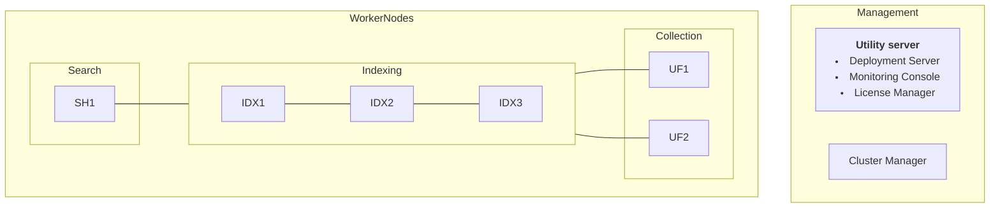

# Distributed Clustered Deployment - Single Site C1

## AWS Environment
9 EC2 instances

| Role            | IP           | Name         |
|-----------------|--------------|--------------|
| Jump Server     | 10.0.3.10    | jump         |
| Search Head     | 10.0.0.31    | sh-1         |
| Cluster Manager | 10.0.0.21    | cm-1         |
| Utility server  | 10.0.0.22    | utl-1        |
| Indexer 1       | 10.0.0.11    | idx-1        |
| Indexer 2       | 10.0.0.12    | idx-2        |
| Indexer 3       | 10.0.0.13    | idx-3        |
| Forwarder 1     | 10.0.0.41    | fwd-1        |
| Forwarder 2     | 10.0.0.42    | fwd-2        |

The Jump Server will be assigned a public IP address that can be used to gain access to all other servers in the lab
