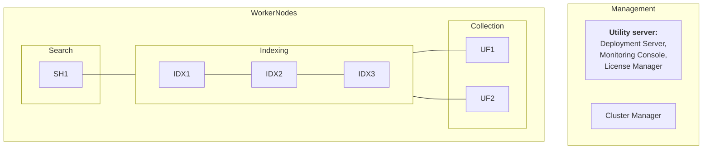
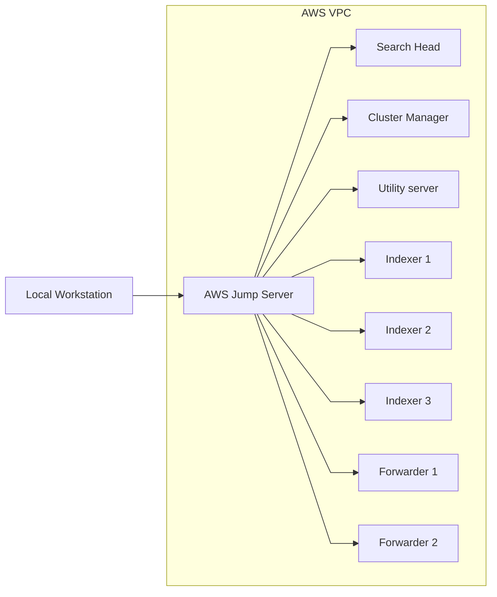

# Distributed Clustered Deployment - Single Site C1



## AWS Environment
1 VPC with both a public and private subnet

9 EC2 instances will be deployed, one "Jump Server" with a public IP will be used to gain access to the lab environment. The remaining 8 servers will be used to deploy a distributed Splunk enviroment.

The Jump Server will be the only server that has a public IP address and routing to the internet.


| Role            | IP           | Name         |
|-----------------|--------------|--------------|
| Jump Server     | 10.0.3.10    | jump         |
| Search Head     | 10.0.0.31    | sh-1         |
| Cluster Manager | 10.0.0.21    | cm-1         |
| Utility server  | 10.0.0.22    | utl-1        |
| Indexer 1       | 10.0.0.11    | idx-1        |
| Indexer 2       | 10.0.0.12    | idx-2        |
| Indexer 3       | 10.0.0.13    | idx-3        |
| Forwarder 1     | 10.0.0.41    | fwd-1        |
| Forwarder 2     | 10.0.0.42    | fwd-2        |


### SSH Access to lab


## Terraform Code

The terraform directory contains code that will deploy the EC2 instances listed above. A username can be provided using the `ec2_username` variable (default ec2-user). At least one public key must be provided using the `admin_computer_public_keys` variable, the provided keys will be placed in `/home/<ec2_username>/.ssh/authorized_keys` on the "Jump Server" EC2 instance.

When running terraform apply using the default value for `jump_server_public_key` (Empty string) only the "Jump Server" EC2 instance will be created. A new SSH keypair will be generated for the provided user, the public key for can then be retrieved and provided using the `jump_server_public_key` variable. This key will then be placed in `/home/<ec2_username>/.ssh/authorized_keys` for the remaining EC2 instances.

1. Create tfvars file
    ```bash
    cd terraform
    cat <<EOF > terraform.tfvars
    aws_region   = "<prefered_region>"
    ec2_username = "<prefered_username>"
    admin_computer_public_keys = [
      "<ssh_pub_key_1>",
      "<ssh_pub_key_2>"
    ]
    EOF
    ```

2. Initialise the terraform project and apply
    ```bash
    terraform init
    terraform plan
    terraform apply
    ```

3. Retrieve the generated public key from the "Jump Server" EC2 instance
    ```bash
    ssh <ec2_username>@<jump_server_public_ip> -i ~/.ssh/id_rsa 'cat .ssh/id_rsa.pub'
    ```

4. Add the retrieved public key to your tfvars file
    ```bash
    cat <<EOF >> terraform.tfvars
    jump_server_public_key = <retrieved_public_key>
    EOF
    ```

5. Run terraform apply to deploy remaining EC2 instances
    ```bash
    terraform plan
    terraform apply
    ```
